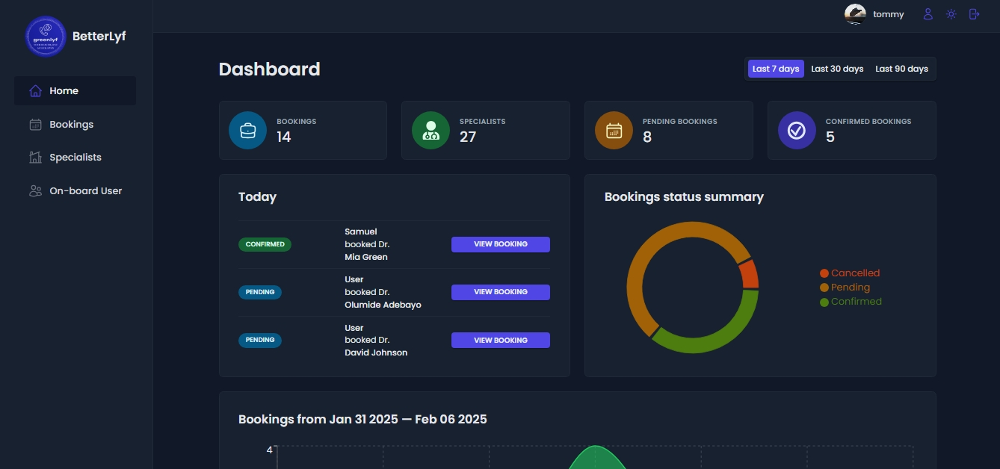

# Betterlyf Admin Panel -

This is the admin app for the [Betterlyf Doctor Booking App](https://www.betterlyf.vercel.app/). The repo can be found here [Betterlyf Github repo](https://github.com/Samsegun/betterlyf)

## Table of contents

-   [Overview](#overview)
    -   [Screenshot](#screenshot)
    -   [Links](#links)
-   [Features](#features)
    -   [Admins](#admins)
    -   [Built with](#built-with)
    -   [Continued development](#continued-development)
-   [Author](#author)
<!-- -   [Acknowledgments](#acknowledgments) -->

## Overview

The Betterlyf Admin Panel is a React-based dashboard where admins manage the platform. It connects to Supabase for database operations and authentication. Users can book appointments with specialists through a separate [Nextjs-based website](https://github.com/Samsegun/betterlyf)

### Screenshot

### Links

<!--
-   Solution URL: [GitHub](https://github.com/Samsegun/Entertainment-web-app)
-   Live Site URL: [Netlify](https://samsegun-entertainment-app.netlify.app/) -->

## Features

### Admins

-   Onboard & manage specialists
-   Oversee bookings & statuses

### Built with

-   Frontend: React Js
-   Database: Supabase
-   Auth: Supabase
-   Remote-State Management: Tanstack Query
-   Dates Functionality: Date-fns
-   Charts: Recharts
-   Styling: styled-components

### Continued development

#### Upcoming Features:

-   Specialists will be able to edit profiles & manage their bookings
-   Improved appointment scheduling & notifications
-   Stripe integration for payments

## Author

-   Github - [Samuel Oyebade](https://github.com/Samsegun/)
-   Gmail - [Oyebade Sam](oyebadesegunsam@gmail.com)
-   X (Twitter) - [@samsegun10](https://www.twitter.com/samsegun10)
